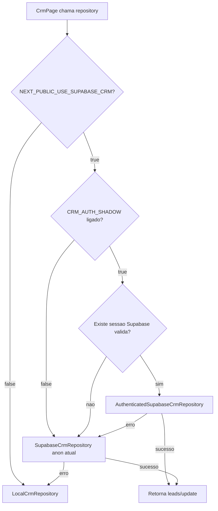

# Sprint 97.3A - Authenticated Shadow Runtime

## Resumo executivo

Esta sprint mapeia como implementar, em sprint futura, um runtime autenticado opcional para o CRM sem alterar o comportamento atual.

O desenho recomendado e criar um novo repository autenticado para `crm_leads`, preservando intacto o `SupabaseCrmRepository` anon atual. O runtime deve tentar `authenticated` apenas quando houver sessao Supabase valida e uma nova feature flag estiver ativa. Se falhar, deve cair para o caminho anon atual e, por fim, para `localStorage`.

Nenhum codigo funcional foi alterado nesta sprint.

## Arquivos analisados

- `modules/crm/repositories/supabase-crm-repository.ts`
- `modules/crm/repositories/index.ts`
- `modules/access/supabase-auth.ts`
- `components/access/login-page.tsx`
- `components/crm/crm-page.tsx`
- `app/page.tsx`
- `lib/supabase/client.ts`
- `.env.example`

## Achados

### Sessao Supabase

A sessao Supabase e criada e persistida em `modules/access/supabase-auth.ts`.

O client de Auth usa:

- `createClient(NEXT_PUBLIC_SUPABASE_URL, NEXT_PUBLIC_SUPABASE_PUBLISHABLE_KEY ?? NEXT_PUBLIC_SUPABASE_ANON_KEY)`
- `persistSession: true`
- `autoRefreshToken: true`
- `detectSessionInUrl: true`

Esse client e usado por:

- `loadSupabaseCurrentUser()`
- `signInWithSupabaseAuth()`
- `signOutFromSupabaseAuth()`
- `requestSupabasePasswordReset()`

O app carrega a sessao Supabase apenas quando `NEXT_PUBLIC_USE_SUPABASE_AUTH === "true"`.

### CRM Supabase atual

O CRM usa `modules/crm/repositories/supabase-crm-repository.ts`.

O client atual usa:

- `NEXT_PUBLIC_SUPABASE_URL`
- `NEXT_PUBLIC_SUPABASE_PUBLISHABLE_KEY`
- `persistSession: false`

Esse client nao carrega sessao autenticada e, portanto, acessa `crm_leads` pelo caminho publico/anon.

### Selecao atual de repository

`modules/crm/repositories/index.ts` escolhe Supabase se:

- `NEXT_PUBLIC_USE_SUPABASE_CRM === "true"`
- `NEXT_PUBLIC_SUPABASE_URL` existe
- `NEXT_PUBLIC_SUPABASE_PUBLISHABLE_KEY` existe

Fluxo atual:

1. Se flag Supabase CRM desligada: `localStorage`.
2. Se flag ligada: tenta `SupabaseCrmRepository`.
3. Se falhar: fallback para `localStorage`.

### Pontos de chamada do CRM

`components/crm/crm-page.tsx` chama:

- `listCrmLeadsFromRepository()` ao carregar leads.
- `updateCrmLeadInRepository()` ao salvar edicao/dossie.
- `updateCrmLeadInRepository()` ao mover lead no pipeline.

Portanto, o ponto certo para wiring futuro e o repository layer, nao o componente.

### App e acesso

`app/page.tsx` carrega `currentUser` por:

- `loadSupabaseCurrentUser()` quando `NEXT_PUBLIC_USE_SUPABASE_AUTH=true`;
- `loadCurrentUser()` quando Auth local esta ativo.

O `currentUser` ja pode conter:

- `id`
- `role`
- `organizationId`
- `email`

Mas esse estado nao e passado para o CRM repository hoje.

### Helper Supabase generico

`lib/supabase/client.ts` cria um client com `NEXT_PUBLIC_SUPABASE_ANON_KEY`, mas a busca estatica nao encontrou uso direto no fluxo atual do CRM.

### Variaveis atuais em `.env.example`

- `NEXT_PUBLIC_SUPABASE_URL`
- `NEXT_PUBLIC_SUPABASE_ANON_KEY`
- `NEXT_PUBLIC_SUPABASE_PUBLISHABLE_KEY`
- `NEXT_PUBLIC_USE_SUPABASE_CRM=false`
- `NEXT_PUBLIC_USE_SUPABASE_AUTH=false`
- `SUPABASE_SERVICE_ROLE_KEY`

Nao existe ainda uma flag especifica para shadow runtime autenticado do CRM.

## Decisoes tecnicas recomendadas

### 1. Nao alterar o SupabaseCrmRepository atual

O repository atual deve continuar representando o caminho anon/public existente.

Motivo:

- rollback simples;
- menor risco de quebrar Bruno;
- logs mais claros;
- separacao explicita entre anon e authenticated.

### 2. Criar um novo AuthenticatedSupabaseCrmRepository

Arquivo futuro sugerido:

`modules/crm/repositories/authenticated-supabase-crm-repository.ts`

Responsabilidade:

- criar client Supabase com sessao persistida;
- chamar `auth.getSession()`;
- operar `crm_leads` somente se houver `session.access_token`;
- usar as mesmas operacoes `list()`, `getById()` e `updateLead()`;
- reaproveitar mapeamento snake_case/camelCase existente, idealmente extraindo mapper comum em sprint futura pequena.

### 3. PersistSession no client autenticado

O novo client autenticado deve usar `persistSession: true`, `autoRefreshToken: true` e `detectSessionInUrl: true`, alinhado ao client de Auth.

O `SupabaseCrmRepository` anon atual deve permanecer com `persistSession: false`.

### 4. Detectar sessao autenticada no repository layer

O CRM pode detectar sessao autenticada de duas formas:

Opcao recomendada:

- o novo repository cria client autenticado e chama `supabase.auth.getSession()`;
- se nao houver sessao, retorna erro controlado para fallback.

Opcao alternativa:

- `app/page.tsx` passa `currentUser` ou uma fonte de Auth para `CrmPage`;
- `CrmPage` passa contexto para repository.

Recomendacao: evitar passar estado por UI nesta etapa. O repository deve resolver a sessao pelo client Supabase para manter UI intacta.

### 5. Feature flag nova

Nova flag futura sugerida:

`NEXT_PUBLIC_USE_SUPABASE_CRM_AUTH_SHADOW=true`

Comportamento:

- ausente ou diferente de `"true"`: comportamento atual intacto;
- `"true"`: repository layer tenta authenticated primeiro, depois anon, depois localStorage.

Nao substituir `NEXT_PUBLIC_USE_SUPABASE_CRM`. A nova flag deve depender dela.

Condição recomendada:

```ts
const shouldUseAuthenticatedShadow =
  process.env.NEXT_PUBLIC_USE_SUPABASE_CRM === "true" &&
  process.env.NEXT_PUBLIC_USE_SUPABASE_CRM_AUTH_SHADOW === "true";
```

### 6. Ordem de fallback

Quando shadow estiver ligado:

1. Tentar `AuthenticatedSupabaseCrmRepository`.
2. Se nao houver sessao ou falhar por RLS/policy: logar e tentar `SupabaseCrmRepository` anon atual.
3. Se anon falhar: cair para `LocalCrmRepository`.

Quando shadow estiver desligado:

1. Manter comportamento atual: anon Supabase se `NEXT_PUBLIC_USE_SUPABASE_CRM=true`, senao localStorage.

### 7. Logs de caminho usado

Logs futuros recomendados:

- `[EVOLV CRM] Fonte ativa: Supabase authenticated shadow.`
- `[EVOLV CRM] Sessao Supabase ausente. Usando fallback anon.`
- `[EVOLV CRM] Authenticated shadow falhou. Usando fallback anon.`
- `[EVOLV CRM] Fonte ativa: Supabase anon.`
- `[EVOLV CRM] Fonte ativa: localStorage.`

Evitar payload completo de lead nos logs. Registrar apenas:

- fonte;
- operacao (`list`, `getById`, `updateLead`);
- id;
- campos alterados.

## Fluxo proposto



## Pseudocodigo

```ts
export async function listCrmLeadsFromRepository(): Promise<CrmLead[]> {
  if (!canUseSupabaseCrmRepository()) {
    console.info("[EVOLV CRM] Fonte ativa: localStorage.");
    return localCrmRepository.list();
  }

  if (canUseAuthenticatedCrmShadowRepository()) {
    try {
      console.info("[EVOLV CRM] Fonte ativa: Supabase authenticated shadow.");
      return await createAuthenticatedSupabaseCrmRepository().list();
    } catch (error) {
      console.warn(
        "[EVOLV CRM] Authenticated shadow falhou. Usando fallback anon.",
        error,
      );
    }
  }

  try {
    console.info("[EVOLV CRM] Fonte ativa: Supabase anon.");
    return await createSupabaseCrmRepository().list();
  } catch (error) {
    console.warn("Falha ao ler CRM no Supabase anon. Usando localStorage.", error);
    return localCrmRepository.list();
  }
}
```

O mesmo padrao deve ser aplicado a:

- `getCrmLeadByIdFromRepository()`
- `updateCrmLeadInRepository()`

## Arquivos que seriam alterados futuramente

### Sprint 97.3B

- Criar: `modules/crm/repositories/authenticated-supabase-crm-repository.ts`
- Possivelmente criar: `modules/crm/repositories/supabase-crm-mappers.ts`
- Alterar: `modules/crm/repositories/index.ts`
- Alterar: `.env.example`

### Sprint 97.3C

- Alterar: `modules/crm/repositories/index.ts`
- Alterar: `modules/crm/repositories/authenticated-supabase-crm-repository.ts`
- Opcional: adicionar logs controlados.

### Evitar alterar

- `components/crm/crm-page.tsx`
- `app/page.tsx`
- `components/access/login-page.tsx`
- `modules/access/supabase-auth.ts`

A nao ser que a implementacao futura prove que o repository nao consegue acessar a sessao Supabase de forma confiavel.

## Plano de implementacao futura

### Sprint 97.3B - Repository authenticated novo

Objetivo:

- criar `AuthenticatedSupabaseCrmRepository`;
- usar client Supabase com sessao persistida;
- implementar `list`, `getById`, `updateLead`;
- nao alterar wiring operacional ainda;
- manter flag desligada.

Aceite:

- typecheck/lint/build passam;
- repository existe, mas nao e usado em producao.

### Sprint 97.3C - Wiring por flag

Objetivo:

- adicionar `NEXT_PUBLIC_USE_SUPABASE_CRM_AUTH_SHADOW=false`;
- quando ativa, tentar authenticated primeiro;
- fallback anon;
- fallback localStorage;
- logs de fonte ativa.

Aceite:

- flag desligada preserva comportamento atual;
- flag ligada nao quebra se nao houver sessao.

### Sprint 97.3D - Smoke test Camille

Objetivo:

- ativar shadow apenas em ambiente controlado;
- Camille loga via Supabase Auth;
- testar listagem;
- testar update simples;
- confirmar que total permanece 763;
- confirmar logs `authenticated shadow`.

Aceite:

- operação funciona com sessao Camille;
- fallback anon permanece disponivel.

### Sprint 97.3E - Smoke test Bruno

Objetivo:

- repetir teste com Bruno;
- validar profile ativo;
- validar operacao real sem regressao.

Aceite:

- Bruno opera CRM sem perceber diferenca;
- logs confirmam caminho autenticado ou fallback controlado.

### Sprint 97.4 - Policies organizacionais

Objetivo:

- substituir policies bridge por policies com `organization_id`;
- preservar fallback durante transicao;
- validar leitura/escrita restrita a `profiles.organization_id`.

Aceite:

- Camille e Bruno acessam somente Patrion EVOLV;
- nenhum lead fica invisivel indevidamente.

### Sprint 98 - Remocao anon

Objetivo:

- remover/revogar anon somente apos shadow autenticado validado;
- manter rollback planejado;
- confirmar zero dependencia restante do caminho anon.

Aceite:

- CRM funciona autenticado;
- anon removido sem indisponibilidade.

## Riscos

| Risco | Severidade | Mitigacao |
| --- | --- | --- |
| Client autenticado nao encontrar sessao | Alto | Fallback anon e flag desligada por padrao. |
| Duplicacao de mapper entre repositorios | Medio | Extrair mapper comum em microstep controlado. |
| Logs vazarem dados de clientes | Alto | Logar apenas fonte, id e campos, nunca payload completo. |
| Auth flag ligada antes de profiles maduros | Alto | Shadow depende de sessao valida; manter rollback por flags. |
| Remover anon cedo demais | Critico | So Sprint 98, depois de smoke tests. |
| RLS final bloquear leads sem organization_id | Critico | Contexto confirma backfill, mas validar novamente antes de policies finais. |

## Recomendacao final

A implementacao futura deve ser feita no repository layer, nao na UI. A UI do CRM deve continuar chamando as mesmas funcoes:

- `listCrmLeadsFromRepository`
- `getCrmLeadByIdFromRepository`
- `updateCrmLeadInRepository`

O runtime autenticado deve ser apenas uma nova fonte interna opcional, ativada por flag e com fallback imediato.

## Confirmacoes desta sprint

- Nenhum codigo funcional foi alterado.
- Nenhum SQL foi executado.
- Nenhuma policy, grant ou RLS foi alterado.
- Nenhum dado foi alterado.
- Nenhum frontend foi alterado.
- Nenhuma flag foi alterada.
- Anon permanece preservado.
- Bruno deve perceber zero diferenca operacional.

## Sprint 97.3B implementation notes

Implementacao isolada criada:

- `modules/crm/repositories/authenticated-supabase-crm-repository.ts`

O novo repository implementa o mesmo contrato `CrmRepository`:

- `list()`
- `getById(id)`
- `updateLead(id, patch)`

Caracteristicas:

- usa `createClient` com `persistSession: true`, `autoRefreshToken: true` e `detectSessionInUrl: true`;
- chama `supabase.auth.getSession()` antes de cada operacao;
- se nao houver sessao valida, lança erro controlado para permitir fallback futuro;
- usa somente variaveis publicas (`NEXT_PUBLIC_SUPABASE_URL`, `NEXT_PUBLIC_SUPABASE_PUBLISHABLE_KEY` ou fallback `NEXT_PUBLIC_SUPABASE_ANON_KEY`);
- nao usa `SUPABASE_SERVICE_ROLE_KEY`;
- nao loga payload completo de lead;
- registra apenas logs seguros de caminho authenticated, operacao, id, total ou campos.

Exportacao passiva:

- `modules/crm/repositories/index.ts` exporta o novo repository.
- Nenhuma funcao de selecao runtime foi alterada.
- `listCrmLeadsFromRepository`, `getCrmLeadByIdFromRepository` e `updateCrmLeadInRepository` continuam usando o fluxo atual.

O novo repository ainda nao esta conectado ao CRM operacional. A ativacao deve acontecer apenas em sprint futura por feature flag, conforme plano da Sprint 97.3C.

## Sprint 97.3C implementation notes

Implementacao controlada por flag criada no repository layer.

Arquivos alterados:

- `modules/crm/repositories/index.ts`
- `.env.example`

Flag nova documentada:

- `NEXT_PUBLIC_USE_SUPABASE_CRM_AUTH_SHADOW=false`

Comportamento:

- Com a flag ausente ou diferente de `"true"`, o fluxo permanece igual ao atual: Supabase anon quando `NEXT_PUBLIC_USE_SUPABASE_CRM=true`, com fallback para `localStorage`.
- Com a flag `"true"`, o repository tenta `AuthenticatedSupabaseCrmRepository` primeiro.
- Se authenticated falhar por ausencia de sessao ou erro de permissao, cai para `SupabaseCrmRepository` anon.
- Se anon falhar, cai para `LocalCrmRepository`.

Ordem efetiva com shadow ligado:

1. Supabase authenticated shadow.
2. Supabase anon atual.
3. localStorage.

Ordem efetiva com shadow desligado:

1. Supabase anon atual, se `NEXT_PUBLIC_USE_SUPABASE_CRM=true`.
2. localStorage.

O wiring nao alterou `crm-page.tsx`, login, middleware, `app/page.tsx`, Supabase Auth, SQL, RLS, policies ou grants.

Rollback:

- manter ou retornar `NEXT_PUBLIC_USE_SUPABASE_CRM_AUTH_SHADOW=false`;
- nenhum rollback de banco e necessario;
- anon e localStorage permanecem preservados.
